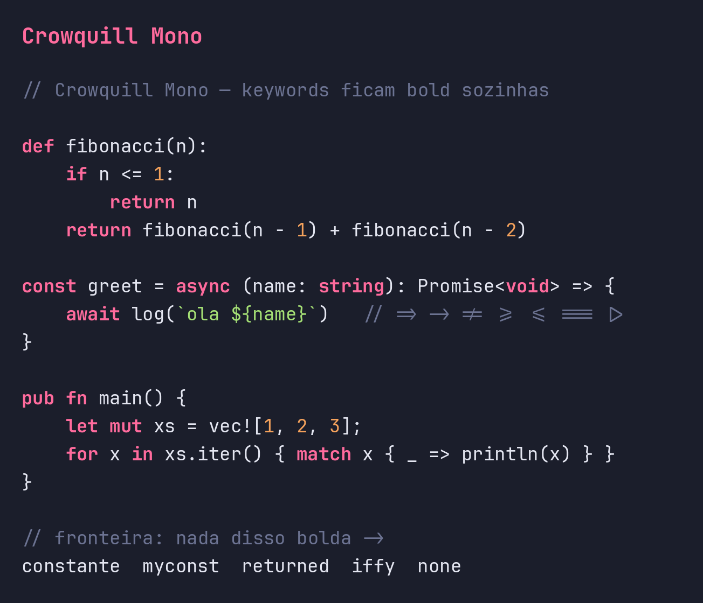

# Crowquill Mono

[](https://github.com/andersonflima/crowquill-mono/releases)
[](https://github.com/andersonflima/homebrew-fonts)
[](OFL.txt)

Fonte de programação que **deixa as palavras reservadas em negrito automaticamente** —
a própria fonte diferencia keywords das linguagens, sem depender do tema do editor.

Base **JetBrains Mono** (métrica, legibilidade e ligaduras nativas preservadas), com uma
feature OpenType `calt` que troca a sequência exata de uma keyword pelos glifos em negrito,
**só quando é a palavra inteira** — `const` bolda, `constante`/`myconst`/`const_val` não.

Acompanha um **tema casado** (VS Code + Neovim) que reforça o destaque com cor.



## Como funciona (o truque)

Uma fonte não entende a linguagem — ela casa **sequências de caracteres**. Então:

1. Copiamos os glifos das letras da JetBrains **Bold** para dentro da Regular como
   variantes `a.kw`, `b.kw`, … (mesma largura mono, sem distorção).
2. Geramos uma feature `calt` com **guarda de fronteira**: para cada keyword há regras
   `ignore` que cancelam a troca quando a palavra está colada a outro caractere de
   identificador (`[A-Za-z0-9_]`). Só quando é token isolado a troca `letra → letra.kw`
   acontece.
3. As **ligaduras nativas** da JetBrains são preservadas (fazemos *merge* no GSUB em vez de
   sobrescrever).

Cobertura atual: **338 keywords** de 14 linguagens (JS/TS, Python, Go, Rust, C#, Haskell,
Elixir, C/C++, Java, Ruby, SQL, Bash). O Python `True/False/None` (maiúsculo) e o `true/false`
(minúsculo) coexistem; SQL é tratado em minúsculo.

> Limite honesto: sem contexto semântico, a keyword bolda também dentro de string/comentário.
> O **tema** cobre esse caso (comentário/string têm cor própria e prioridade visual).

## Instalar

### Via Homebrew (recomendado)

```bash
brew tap andersonflima/fonts
brew install --cask font-crowquill-mono
```

> O Homebrew pode pedir para confiar no tap na primeira vez: `brew trust andersonflima/fonts`.

Isso instala **só a fonte**. Para o **tema** do editor, use o `install.sh` abaixo ou os arquivos em `editor/`.

### Fonte + tema (script do repo)

```bash
./scripts/install.sh          # fontes + tema VS Code + colorscheme Neovim
```

Depois:

- **VS Code** — cole `editor/vscode/settings-snippet.jsonc` no seu settings. É obrigatório
  `"editor.fontLigatures": true` (o negrito-de-keyword é `calt`). Selecione o tema
  *Crowquill Dark*.
- **Neovim** — veja `editor/nvim/README.md`. Terminal com suporte a ligaduras (kitty, WezTerm,
  Ghostty) mostra o negrito da fonte; o colorscheme já mantém `@keyword` em bold como fallback.

## Build a partir do código

```bash
python3 -m venv .venv && ./.venv/bin/pip install fonttools uharfbuzz pillow
./.venv/bin/python scripts/build.py      # gera dist/CrowquillMono-{Regular,Bold}.ttf
./.venv/bin/python scripts/verify.py     # shaping HarfBuzz: prova o comportamento
./.venv/bin/python scripts/specimen.py   # gera dist/specimen.png
```

As fontes-fonte ficam em `sources/` (baixadas dos releases oficiais); a lista de keywords em
`sources/keywords.json`.

## Roadmap

- **v0.1 (atual)** — JetBrains base + keyword-bold + ligaduras nativas + tema.
- **v0.2** — enxertar letterforms informais do **Comic Neue** (OFL) num conjunto curado de
  glifos (`a`, `g`, `y`, `l`, `i`…) para o toque "Comic Sans", ajustados à célula mono.
- **v0.3** — opção de ligaduras estilo **Fira Code** adicionais; variante Nerd Font (ícones).

## Licenças / atribuição

- **JetBrains Mono** — SIL Open Font License 1.1.
- **Fira Code** — SIL Open Font License 1.1.
- **Comic Neue** — SIL Open Font License 1.1 (substituto aberto do Comic Sans, que é
  proprietário e não pode ser redistribuído/derivado).

Este projeto é um derivado sob **OFL 1.1**. "Crowquill Mono" não usa os nomes reservados das
fontes originais.
